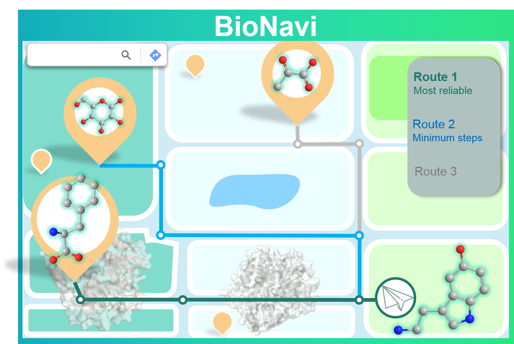

### Introduction
Source code for the paper "Developing BioNavi for Hybrid Retrosynthesis Planning". (Soon to be published in **)



###  Setup
BioNavi requires anaconda with Python 3.7 or later. 

You will wish to install BioNavi in a virtual environment to prevent conflicting dependencies.

```python
sudo apt-get install graphviz # optional: for output visualization
conda create -n bionavi python==3.7
conda activate bionavi
sh install.sh
```

###  Precursor prediction
We provide the pre-trained ensemble models for precursor prediction, one needs to first download the [checkpoints](https://doi.org/10.6084/m9.figshare.25118075) and unzip under ```transformer/checkpoints/```.
You can also train your models with the following steps:

```
cd transformer
```

#### Preprocess the data

```python
onmt_build_vocab -config config/vocab.yaml -n_sample -1
```

#### Train the model

```python
onmt_train -config config/train.yaml
```
Note: Four models were trained with different seeds to obtain the ensemble model. 

#### Make prediction

```python
onmt_translate -src data/test_src.txt -output prediction/test_pred.txt \
                     -batch_size 32 -replace_unk -beam_size 10 -n_best 10 -gpu 0 -max_length 200 \
                     -model checkpoints/retro_seed_0.pt checkpoints/retro_seed_1024.pt \
                            checkpoints/retro_seed_1234.pt checkpoints/retro_seed_2023.pt
```
 
#### evaluate the prediction

```python
python eval_single.py -targets data/test_tar.txt \
    -predictions prediction/test_pred.txt \
    -invalid_smiles -beam_size 10
```

### Pathway planning
Now return to the main directory

```
cd ..
```

You can set the parameters by ```config/bionavi_conf.yaml```, then run

```python
python run_bionavi.py
```

### Testing on the test set

Our work on BioNavi features an evaluation on our test set. We automated this evaluation by

```python
python run_bionavi_batch.py
```

### Evaluate the pathway prediction

```python
python script/eval_pathway.py
```
